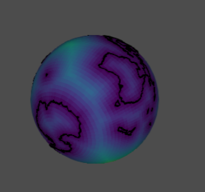

<!-- README.md is generated from README.Rmd. Please edit that file -->

```{r setup, include = FALSE}
knitr::opts_chunk$set(
  collapse = TRUE,
  comment = "#>",
  fig.path = "man/figures/README-",
  out.width = "100%"
)
```
# distancetocoast

The goal of distancetocoast is to provide an easy lookup for the "distance to coastline" for longitude and latitude coordinates. 

Use at your own risk! Literally each of "distance", "to" and "coast" are hard
to define carefully, but often we need an easy way to find approximations. 


## Installation

The distancetocoast package may be installed from Github using devtools. 

```{r,eval=FALSE}
devtools::install_github("mdsumner/distancetocoast")
```


## Example

There is an in-built data set, in `raster` format. The raster package
includes an `extract` function which will look up a cell value at 
a given longitude and latitude location. 

This value is the distance to the coastline from the centre of the cell. 
```{r example}
library(distancetocoast)
library(raster)
## beware of clashing with tidyr::extract
raster::extract(distance_to_coastline_lowres, cbind(147, -42))
```

This is a very approximate value, and it will depend on the content and quality of the coastline data used, on the resolution of the grid itself, some un-quantified local distortions due to coordinate transformations and discretization, and may not be accurate for some applications. 

There will be some regions inside oceans, inside land, and inside lakes as defined by the coastline. We make no distinction for "inside" anything, this is purely distance to the line. A matching "land mask" layer could be added to provide a flag for these regions, but this is a deep can of worms ...


This grid was created by process it in tiles, reprojecting the coastline and the grid pixel centres to a local Lambert Azimuthal Equidistant projection (`aeqd` in [PROJ.4](http://proj4.org/projections/aeqd.html) terms) and calculating shortest Cartesian distance to the coastline coordinate in that projection. (We used the `nabor` package). 

```{r}
plot(distance_to_coastline_lowres, col = viridis::viridis(64))
plot(rnaturalearth::ne_coastline(), add = TRUE)
```
The in-built data can be interrogated directly for its properties. 

```{r}
## resolution (cell size in native coordinates)
raster::res(distance_to_coastline_lowres)

## dimensions (number of columns and rows)
dim(distance_to_coastline_lowres)

## the extent, in native coordinates
raster::extent(distance_to_coastline_lowres)

## the "CRS", coordinate reference system (the map projection)
raster::projection(distance_to_coastline_lowres)

## the range of values (distance in metres)
cellStats(distance_to_coastline_lowres, min)
cellStats(distance_to_coastline_lowres, max)
```

All of this information may be seen in one step by using the print method. 

```{r}
distance_to_coastline_lowres
```


There are also higher resolution layers created from the Natural Earth coastline "50" and "10" scale coastline data sets. 


```{r}
ex <- extent(140, 160, -60, -40)
plot(crop(distance_to_coastline_10, ex), col = viridis::viridis(64))
plot(rnaturalearth::ne_coastline(10), add = TRUE)

plot(crop(distance_to_coastline_10, extent(157, 160, -57, -54)), col = viridis::viridis(64))
plot(rnaturalearth::ne_coastline(10), add = TRUE)

extract(distance_to_coastline_10, cbind(142, -42))
extract(distance_to_coastline_lowres, cbind(142, -42))

```

See '/data-raw/' for the code used to produce all layer. 


## Development

We hope to add more data sets with a wider choice of methods so that an appropriate choice can be made for specific applications. 

## Fun

For a bit of fun, let's plot as a globe (might not work on Github, but easy enough to run locally). 

```{r}
library(quadmesh)
library(rgl)
library(proj4)

to_globe <- function(x, fact = 12) {
  if (fact > 1) x <- raster::aggregate(distance_to_coastline_lowres, fact = fact)
  qm <- quadmesh(x)
  v <- proj4::ptransform( t(qm$vb[1:3, ]) * pi/180, 
                          raster::projection(x), 
                         "+proj=geocent +datum=WGS84")
  qm$vb[1:3, ] <- t(v)
  scl <- function(x) {rg <- range(x, na.rm = TRUE);(x - rg[1])/diff(rg)}

  qm$material <- list(color = rep(viridis::viridis(64L)[scl(raster::values(x)) * 63L + 1], each = 4))
  qm
}
globe <- to_globe(distance_to_coastline_lowres, fact = 4)
rgl::rgl.clear()
rgl::shade3d(globe, specular = "black")

library(tidyverse)
library(spbabel)
rbind_na <- function(x) rbind(x, NA)
mk_lines <- function(x) {
  mat <- spbabel::sptable(x) %>% 
    split(.$branch_) %>% 
    purrr::map_df(rbind_na) %>% 
    dplyr::select(x_, y_) %>%   dplyr::slice(-1) %>% as.matrix()
    as_tibble(proj4::ptransform( as.matrix(mat) * pi/180, 
                          raster::projection(x), 
                         "+proj=geocent +datum=WGS84"))
}
#rgl.clear()
rgl::lines3d(mk_lines(rnaturalearth::ne_coastline()), col = "black", lwd = 3)
#rgl::rglwidget()
#rgl::rgl.snapshot("man/figures/globe1.png")
```



Please note that this project is released with a [Contributor Code of Conduct](CONDUCT.md). By participating in this project you agree to abide by its terms.

